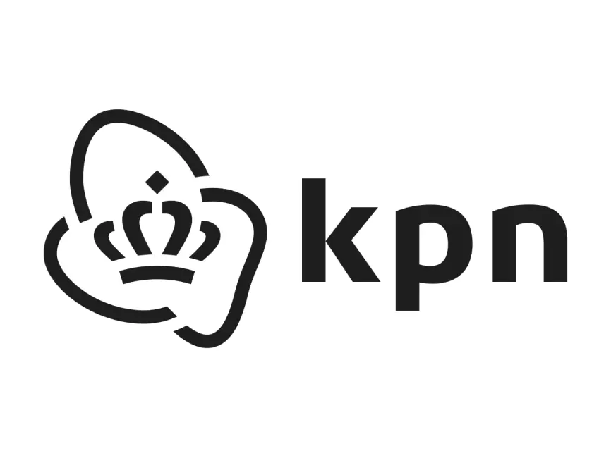

<p align="center">
  
  
</p>

# Triplet Extraction Framework for Knowledge Graph Population

This repository contains the implementation details and code for my thesis project, which focuses on developing a Triplet Extraction framework to populate an industrial Knowledge Graph, particularly for identifying customer problems in dialogues at KPN.

## Abstract

With the advent of deep learning techniques, state-of-the-art results have been achieved in many NLP tasks, including Entity Recognition and Relation Classification. These techniques, however, require a large amount of training data to be effective. This work proposes a pipeline for creating a Triplet Extraction framework, aiming to populate an industrial Knowledge Graph while reducing the resources required for building such a system. The uniqueness of this work lies in addressing Triplet Extraction for dialogues in customer-agent interactions at KPN. The project is divided into four main subtasks:
1. Creating the modelling and schema requirements of the Knowledge Graph.
2. Building a weak supervision framework for programmatically generating training data.
3. Training deep learning models for Entity Recognition and Relation Classification.
4. Integrating these techniques to generate a usable Knowledge Graph.

We demonstrate that weak supervision can, to some extent, replace human labeling and effectively train Entity Recognition models with weakly supervised data.


## Repository Structure

- `Preprocessing`: Contains scripts used for creating the training data.
- `weak_supervision`: Methods used for creating the weak supervision framework.
- `models`: Code for training the Entity Recognition and Relation Classification models.

---

This repository serves as a comprehensive guide and practical implementation of the techniques and methodologies discussed in the thesis.

## Prerequisites for Using the Repository

To use this repository, you need to have the following installed:

- **Python (3.10 or higher)**: Ensure you have Python 3.10 or a newer version installed on your system. You can download Python from [python.org](https://www.python.org/downloads/).

- **Poetry**: This project uses Poetry for dependency management and packaging. If you do not have Poetry installed, you can follow the instructions below to install it.

### Installing Poetry

Poetry is a tool for dependency management and packaging in Python. To install Poetry, you have a couple of options:

### Option 1: Install using the official installer script

#### Windows

1. Open PowerShell and run the following command:

   ```powershell
   (Invoke-WebRequest -Uri https://install.python-poetry.org -UseBasicParsing).Content | python -
   ```

#### macOS / Linux

1. Open a terminal and execute the following command:

   ```bash
   curl -sSL https://install.python-poetry.org | python3 -
   ```

### Option 2: Install using pip

You can also install Poetry using pip, Python's package installer. Run the following command:

```bash
pip install poetry
```

### Post-installation

After installing Poetry, it's recommended to restart your terminal or run the following command to make Poetry available in your current session:

```bash
source $HOME/.poetry/env
```

### Verifying Installation

To verify that Poetry has been installed correctly, run:

```bash
poetry --version
```

This command should display the installed version of Poetry.

---

For more detailed instructions and troubleshooting, visit the [official Poetry installation guide](https://python-poetry.org/docs/#installation).